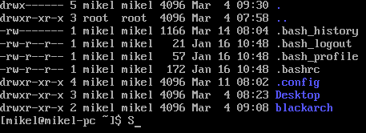
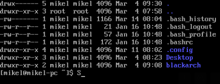
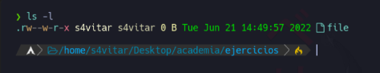

# Baimenak Linuxen
- [Baimenak Linuxen](#baimenak-linuxen)
  - [Fitxategi eta direktorioen baimenak](#fitxategi-eta-direktorioen-baimenak)
    - [baimen taldeak](#baimen-taldeak)
    - [Baimenak esleitzen modu sinbolikoan](#baimenak-esleitzen-modu-sinbolikoan)
    - [Baimenak modu oktalea](#baimenak-modu-oktalea)
  - [Sticky bit baimena](#sticky-bit-baimena)
  - [SUID eta GUID baimenak](#suid-eta-guid-baimenak)
    - [SUID](#suid)
  - [Ezaugarri bereziak - lsattr eta chattr](#ezaugarri-bereziak---lsattr-eta-chattr)
- [Ariketak](#ariketak)
  - [Ariketa 1](#ariketa-1)
  - [Ariketa 2](#ariketa-2)
  - [Ariketa 3](#ariketa-3)
  - [Ariketa 4](#ariketa-4)
  - [Ariketa 5](#ariketa-5)
  - [Ariketa 6](#ariketa-6)
  - [Ariketa 7](#ariketa-7)

## Fitxategi eta direktorioen baimenak

Fitxategi eta direktorioen baimenak hurrengo aginduarekin ikusi ditzakegu

```bash
ls -a
```


### baimen taldeak

- Jabea (user): Fitxategi bat sortzen dugunean, sortzailea jabea izango da defektuz.
- Talde (group): fitxategi baten jabetza talde bati ere bai dagokio 


### Baimenak esleitzen modu sinbolikoan

Linux-en, fitxategi edo direktorioen baimenak kudeatzeko, chmod komandoa erabil daiteke. Baimen motak hiru taldeetan sailkatzen dira:

Berehala (User): Fitxategiaren jabea edo sortzailea.
Taldea (Group): Talde bateko erabiltzaileak.
Besteak (Others): Beste erabiltzaile guztiak.
chmod komandoa erabiliz, erabiltzaile bakoitzak baimenak kontrolatu ditzake. Hau da, fitxategiak edo direktorioak irakurri, idatzi edo exekutatu ahal izateko baimenak kudeatzen dira.

chmod komandoa erabilera:

Oinarrizko sintaxia: chmod permissions file(s)
Adibideak:
chmod +x script.sh: script.sh fitxategiari exekutatzeko baimena ematen dio.
chmod u+x script.sh: Zure buruari (owner) script.sh fitxategiari exekutatzeko baimena ematen dio.
chmod g-w file.txt: Taldeko (group) erabiltzaileek fitxategia idazteko baimenik ez ematen dio.
chmod o-r file.txt: Beste erabiltzaile batzuek fitxategia irakurri ahal izateko baimena kentzen dio.

Adibidez:
```bash
chmod u+x froga.txt
```
Honela taldeari eta besteei exekuzio eta idazteko baimenak emango dizkiegu
```bash
chmod 
```


### Baimenak modu oktalea

- 0 = 000 = baimenarik gabe
- 1 = 001 = -x = exekuzio baimena
- 2 = 010 = -w = idazteko baimena
- 3 = 011 = -wx = idazteko eta exekutzatzeko baimena
- 4 = 100 = r--= irakurtzeko baimena
- 5 = 101 = r-x = irakurtzeko eta exekutatzeko baimena
- 6 = 110 = rw = irakurtzeko eta idazteko baimena
- 7 = 111 = rwx = baimena guztiak

Adibidez baimen guztiak kentzeko
```bash
chmod 000 froga.txt
```
Baimen guztiak gehitzeko
```bash
chmod 777 froga.txt
```
Erabiltzaileari baimen guztiak emateko eta besteei edo taldekideei irakurtze eta exekutatze baimenak emateko
```bash
chmod 755 froga.txt
```

## Sticky bit baimena
Sticky bita daukan fitxategi edo direktorioan bakarrik jabeak edo rootek aldatu dezakete izena eta borratu
```bash
chmod +t froga.txt
```


## SUID eta GUID baimenak

### SUID
SUID aktibatuta dagoenean fitxategi hau exekutatzen duen erabiltzaileak sortzailearen baimenak izango ditu.
```bash
chmod u+s froga.txt
```
Sortu exekutable bat hurrengo edukiarekin eta izenarekin:

suidfroga.sh
```bash
#/bin/bash
echo erabiltzailea
id
echo baimen erabiltzailea
echo $EUID
```

Baimenak esleituko dizkiogu fitxategiari
```bash
chmod 755 suidforga.sh
```

Ezarri SUID suidfroga.sh fitxategiari

```bash
chmod u+s suidfroga.sh
```

```bash
chmod 4755 suidfroga.sh
```
## Ezaugarri bereziak - lsattr eta chattr

Ezaugarri bereziak ikusteko
```bash
lsattr
```
agindua erabiliko dugu

Ezaugarri bereziak aldatzeko
```bash
chattr
```
agindua erabiliko dugu.

Adibidez i atributuarekin fitxategi bat inmutablea bilakatzen dugu. hau esan nahi du inork ezin duela aldatu ez ezabatu, ezta root-ek, ezabatu nahi izakoetan, i atributoa kendu beharko genioke lehenago
```bash
chattr +i froga.txt
lsattr froga.txt
```
**u** ezaugarriarekin fitxategi bat ezabatzen dugunean datuak gordeta gelditzen dira eta berreskurapena ahalbidetzen du.

```bash
chattr +u froga.txt
```

**e** ezaugarriarekin fitxategi bat ezabatzen denean, okupatzen zuen memoria zeroekin berridazten da.

```bash
chattr +e froga.txt
```

**c** ezaugarriarekin fitxategi bat konprimituta gordeko da.
```bash
chattr +c froga.txt
```

**a** ezaugarriarekin fitxategi bati bakarrik gehitu ahal zaizkio gauzak, hau da, ezin da aldatu aurretik zegoen ezer
```bash
chattr +a forga.txt
```
# Ariketak
## Ariketa 1
lotu dagokion baimenarekin:
- 462 r-rw-w
- 123 --x--w--wx
- 711 rwx--x--x
- 333 -wx-wx-wx
- 161 -xrw--x
- 765 rwxrw-r-x
- 567 r-xrw
- 101 --x---x
- 162 --xrw-w-

## Ariketa 2
Zein da fitxategi honen baimenen baimena modu oktalean?

ERANTZUNA: **464**

## Ariketa 3
Jarri hurrengo baimenak modu oktalean

- r--r-xrw- 456
- --xr-xr-- 154
- r-------- 400
- --------x 001
- rwsr-xr-x 4755
- rwxr-sr-x 2755
- r--rw---t 1460

## Ariketa 4
Zer gertatuko da hurrengo agindua exekutatzerakoan?

**1. 'Whoami' komandoaren output-a file fitxategian gordeko da, fitxategiaren jabea izateagatik baimenek ez baitidate eragiten**

## Ariketa 5
Nola lortuko zenuke "file" artxiboaren baimenak ikusten den moduan aldatzeko?

ERANTZUNA:
```bash
chmod g+x file
```
## Ariketa 6
Zortzitarrean zer baimen esleitu beharko dut artxiboak adierazitako baimenak izan ditzan lortzeko?

ERANTZUNA:
```bash
chmod 870 file
```
## Ariketa 7
Honako baimen hauek konfiguratuta dituen fitxategi hau ezabatu ahal izango dut?

1. Bai
2. **Ez**
   