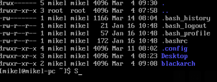
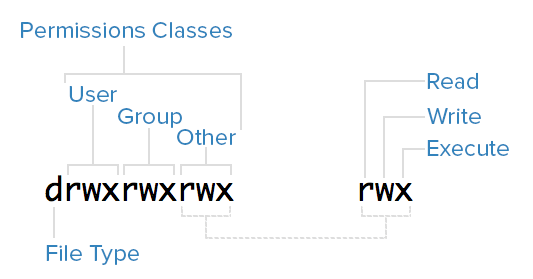
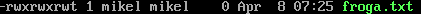

# Baimenak Linuxen
- [Baimenak Linuxen](#baimenak-linuxen)
  - [Fitxategi eta direktorioen baimenak](#fitxategi-eta-direktorioen-baimenak)
    - [baimen taldeak](#baimen-taldeak)
    - [Baimenak esleitzen modu sinbolikoan](#baimenak-esleitzen-modu-sinbolikoan)
    - [Baimenak modu oktalea](#baimenak-modu-oktalea)
  - [Sticky bit baimena](#sticky-bit-baimena)

## Fitxategi eta direktorioen baimenak

Fitxategi eta direktorioen baimenak hurrengo aginduarekin ikusi ditzakegu

```bash
ls -a
```


### baimen taldeak

- Jabea (user): Fitxategi bat sortzen dugunean, sortzailea jabea izango da defektuz.
- Talde (group): fitxategi baten jabetza talde bati ere bai dagokio 



### Baimenak esleitzen modu sinbolikoan

Linux-en, fitxategi edo direktorioen baimenak kudeatzeko, chmod komandoa erabil daiteke. Baimen motak hiru taldeetan sailkatzen dira:

Berehala (User): Fitxategiaren jabea edo sortzailea.
Taldea (Group): Talde bateko erabiltzaileak.
Besteak (Others): Beste erabiltzaile guztiak.
chmod komandoa erabiliz, erabiltzaile bakoitzak baimenak kontrolatu ditzake. Hau da, fitxategiak edo direktorioak irakurri, idatzi edo exekutatu ahal izateko baimenak kudeatzen dira.

chmod komandoa erabilera:

Oinarrizko sintaxia: chmod permissions file(s)
Adibideak:
chmod +x script.sh: script.sh fitxategiari exekutatzeko baimena ematen dio.
chmod u+x script.sh: Zure buruari (owner) script.sh fitxategiari exekutatzeko baimena ematen dio.
chmod g-w file.txt: Taldeko (group) erabiltzaileek fitxategia idazteko baimenik ez ematen dio.
chmod o-r file.txt: Beste erabiltzaile batzuek fitxategia irakurri ahal izateko baimena kentzen dio.

Adibidez:
```bash
chmod u+x froga.txt
```
Honela taldeari eta besteei exekuzio eta idazteko baimenak emango dizkiegu
```bash
chmod 
```


### Baimenak modu oktalea

- 0 = 000 = baimenarik gabe
- 1 = 001 = -x = exekuzio baimena
- 2 = 010 = -w = idazteko baimena
- 3 = 011 = -wx = idazteko eta exekutzatzeko baimena
- 4 = 100 = r--= irakurtzeko baimena
- 5 = 101 = r-x = irakurtzeko eta exekutatzeko baimena
- 6 = 110 = rw = irakurtzeko eta idazteko baimena
- 7 = 111 = rwx = baimena guztiak

Adibidez baimen guztiak kentzeko
```bash
chmod 000 froga.txt
```
Baimen guztiak gehitzeko
```bash
chmod 777 froga.txt
```
Erabiltzaileari baimen guztiak emateko eta besteei edo taldekideei irakurtze eta exekutatze baimenak emateko
```bash
chmod 755 froga.txt
```

## Sticky bit baimena
Sticky bita daukan fitxategi edo direktorioan bakarrik jabeak edo rootek aldatu dezakete izena eta borratu
```bash
chmod +t froga.txt
```
